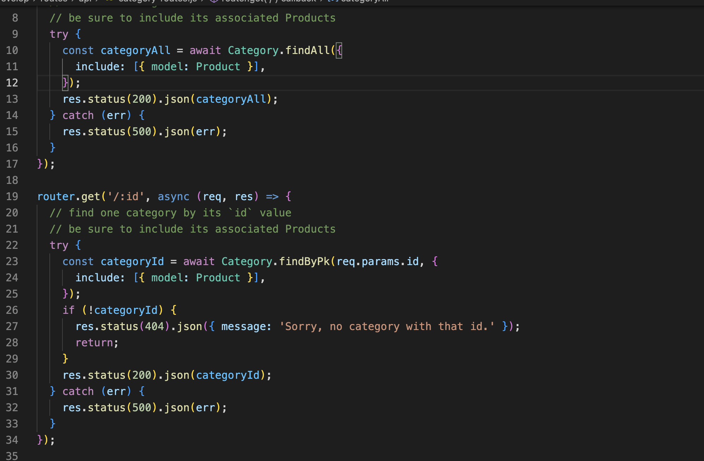
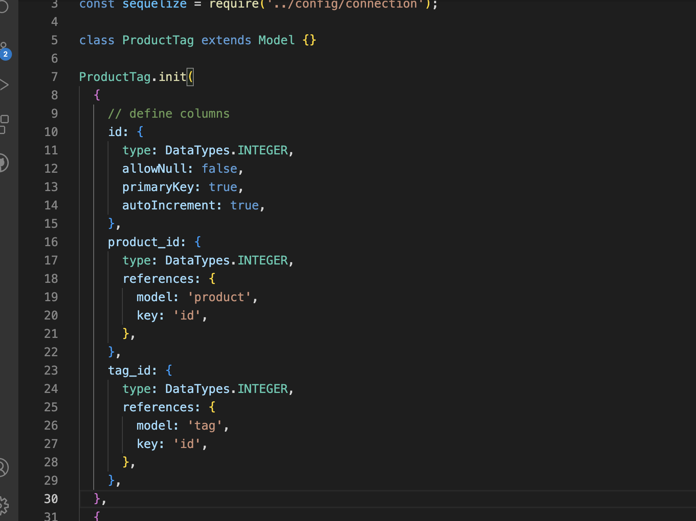

# Using Object Relational Mapping with Sequelize

Ecommerce platforms are in wide use in our everyday lives. The goal of this application is to store product information where it can be associated by unique product, category and tag ids. 
*****

*****
### Using Primary Keys and Foreign Keys

This allows the routes to be easy to read in the code base as well as creating direct routes to associate the products to thier tags and categories. 
*****

*****
### Using Sequelize allows information to be dynamacally added to our tables with MYSQL.

### Tools needed

You will require MYSQL Shell, Sequelize and Express node packages. I will also you Insomnia to test my routes. 

#### Sources

[mysql DECIMAL](https://dev.mysql.com/doc/refman/5.7/en/precision-math-decimal-characteristics.html)

[router method-expree()](http://expressjs.com/en/5x/api.html#router.METHOD)